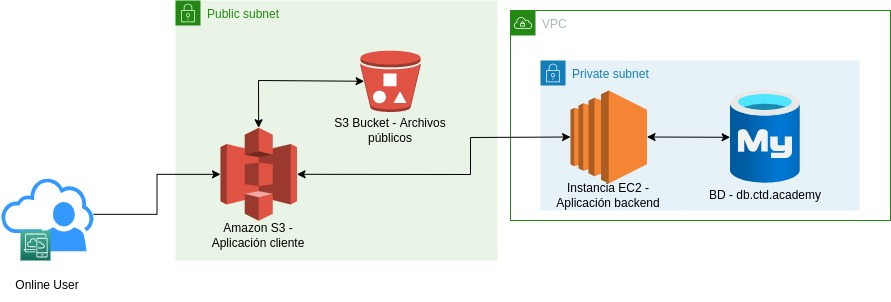

# Estructura de la aplicación

 * La estructura sugerida para nuestra aplicación se puede ver en la siguiente imagen.

Para ello se cuenta con la aplicación corriendo para el cliente corriendo
en Amazon S3, guardando imágenes en un bucket también de S3 para que
el usuario siempre pueda ver los productos ofrecidos.

 Estos componentes estarán compartiendo información a través de una 
 subnet pública, pero la aplicación cliente también intercambiará
 información con una instancia EC2 que contiene el servidor corriendo
 la aplicación backend. En esta sección se compartirá la información a 
 través de una subred privada para así acceder y registrar datos a la BD
 en MySQL suministrada por DigitalHouse.